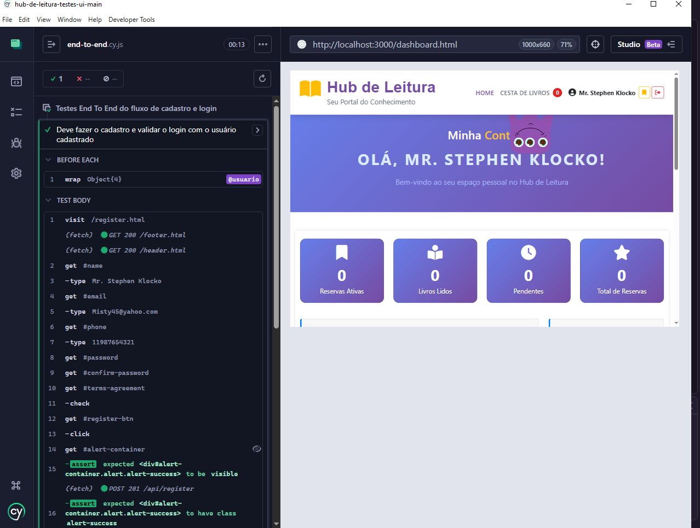
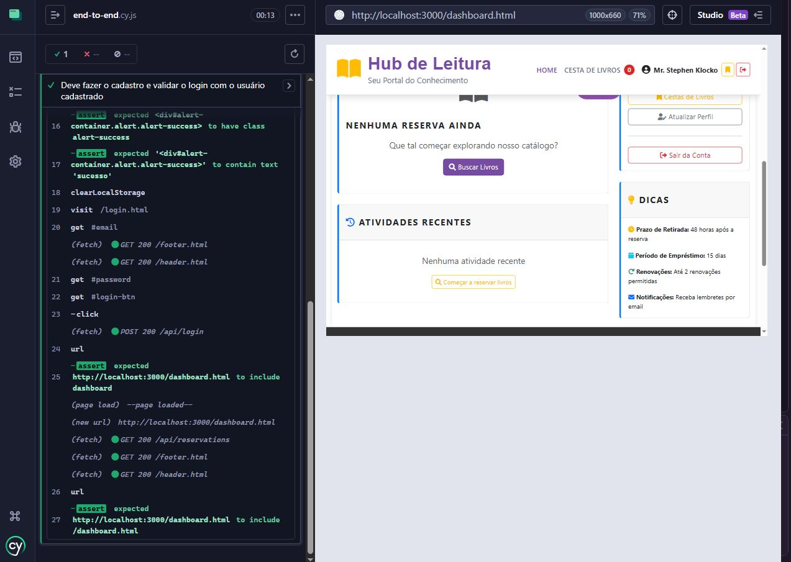
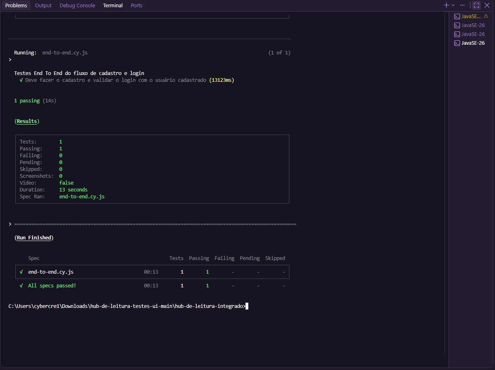

#Projeto de Testes -  Hub de Leitura

## Sobre
Projeto de testes para a aplicação "Hub de Leitura". Este repositório contém a interface e/ou testes automatizados para validação da aplicação.

## Pré-requisitos
- Git
- Node.js (recomendado >= 14)

## Como clonar
1. Abra o terminal.
2. Clone o repositório:
    - git clone <URL-DO-REPOSITORIO>
3. Acesse a pasta do projeto:
    - cd <NOME-DO-REPOSITORIO>

## Instalar dependências
- Usando npm:
  - npm install

## Executar em desenvolvimento
- npm run dev
ou
- npm start
(A opção exata depende dos scripts definidos em package.json; verifique-os se necessário.)

Abra o navegador em http://localhost:3000 (ou a porta indicada no terminal).

## Rodar testes
- Testes unitários:
  - npm test
- Testes end-to-end (se houver, ex.: Cypress):
  - npx cypress open
  - npx cypress run

Verifique os scripts em package.json para nomes específicos (por exemplo, test:unit, test:e2e).

## Build para produção
- npm run build

Os artefatos serão gerados na pasta indicada pelo projeto (ex.: dist, build).

## Variáveis de ambiente
Se houver um arquivo exemplo (.env.example), copie para .env e ajuste conforme necessário:
- cp .env.example .env

## Contribuição
- Abra issues para bugs ou melhorias.
- Envie pull requests com descrições claras das mudanças.

## Ajuda / Problemas comuns
- Atualize dependências: rm -rf node_modules && npm install
- Verifique a versão do Node.js se algum pacote não compilar.

## Evidência de execução

Teste end-to-end (cadastro + login) rodando com sucesso no Cypress:

**1 de 1 cenário passando (modo interativo):**

**Redirecionamento validado para o dashboard após o login:**

**Execução em modo headless pelo terminal:**

